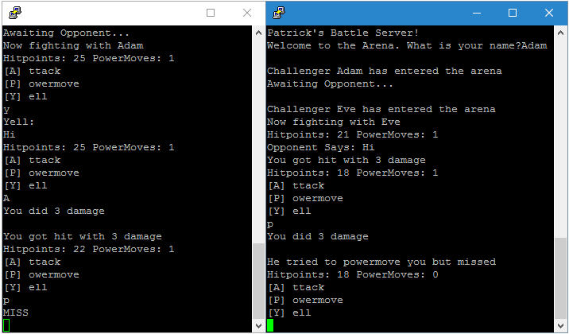

## Synopsis

A socket based network game made for one of my 2nd year undergraduate courses written in C.

## Setup

* Run makefile (You can change the port# here)
* ./battleserver to create server
* You will need two clients to connect to the server to battle
** stty -icanon; /bin/nc [HOST] [PORT]

## Preview

